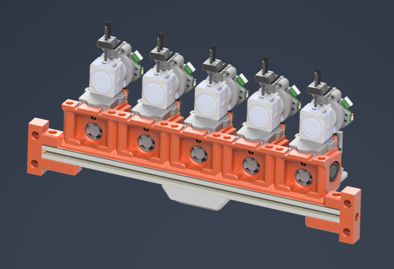
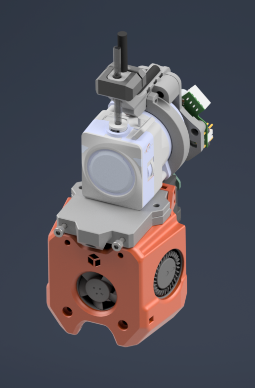
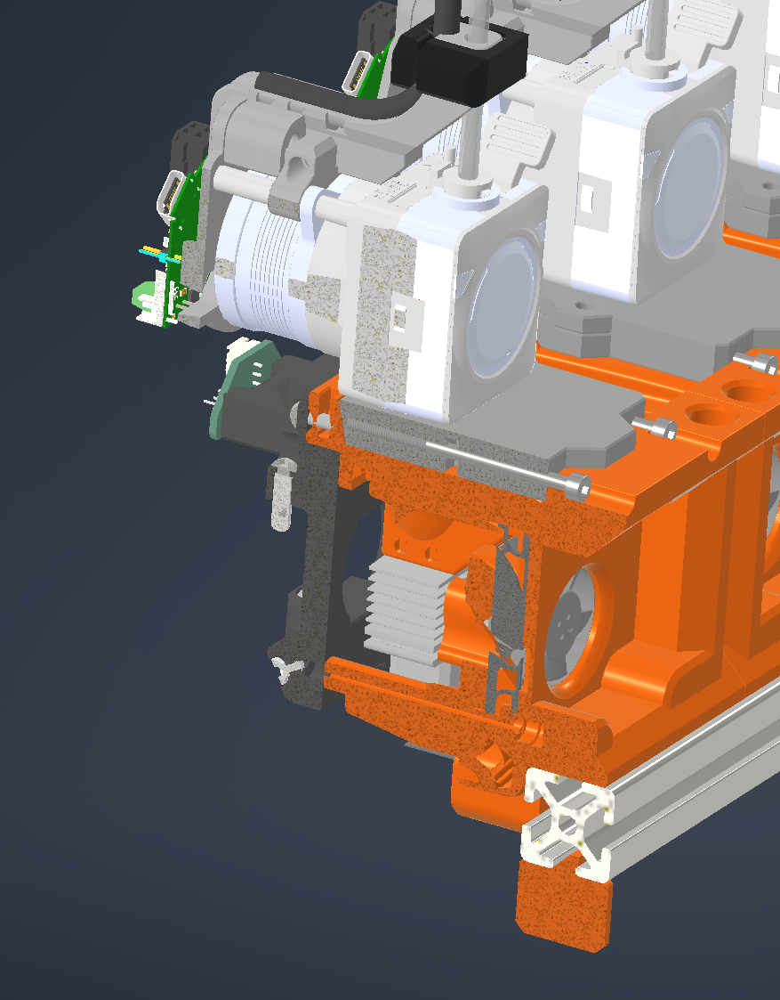
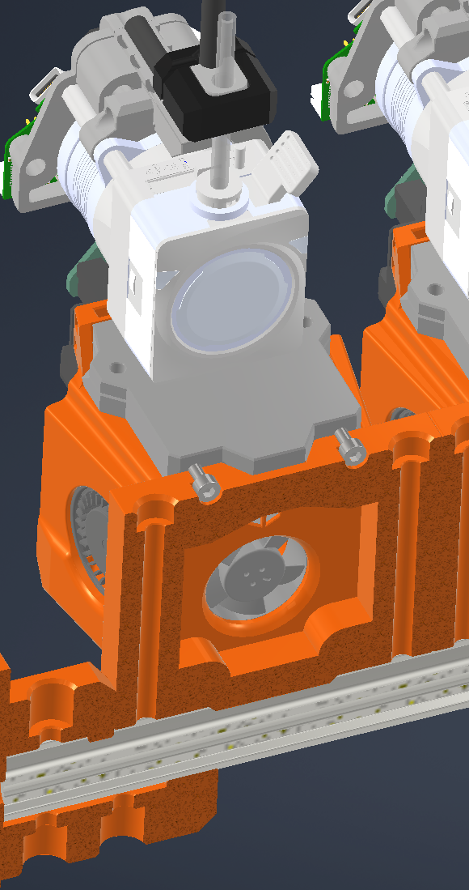

# Docks for A4T with extruder-adapters made for easy dock and undock.

They are made like this because I had issues with unstable positioning in modulardocks. Most issues occur due to the form of the fan ducts.

For a 250mm build you can use 4 tools, for 300mm and 350mm 5 tools is max.

 

The extruder adapters are compatable with Nebula, LGX-lite and hextrudort or extruder with similar mounting pattern.\
Also all Extruder with Sherpa Mini mounting can be used.

## BOM

- M3x50 SHCS (2x per toolhead)
- M5x60 SHCS (2x per toolhead)
- (optional) M3 square nuts 
- 6x3mm magnets
- A4T cowl of choice

## Toolhead fixing

See: https://github.com/Armchair-Heavy-Industries/A4T

This is WIP, will be compatible with crossbow cutter in the future.

### License clarification regarding non-commercial use:
The non-commercial aspect of this license is for cases where the designs are the product, not the use of the designs to create products. 
I.e. if you wish to sell the designs as a product, you would need to seek a commercial license before doing so.  
It is NOT intended to prevent the use of the designs in a printer that you use to provide commercial services. If you want to use the designs for your print farm printers, go right ahead.
