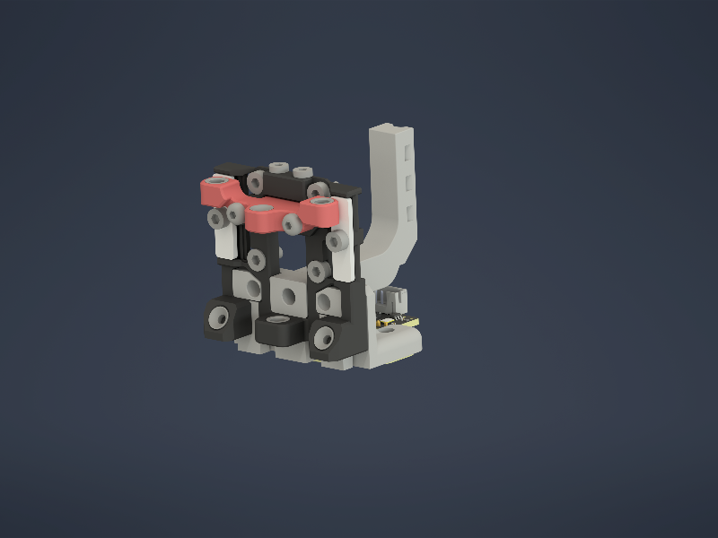
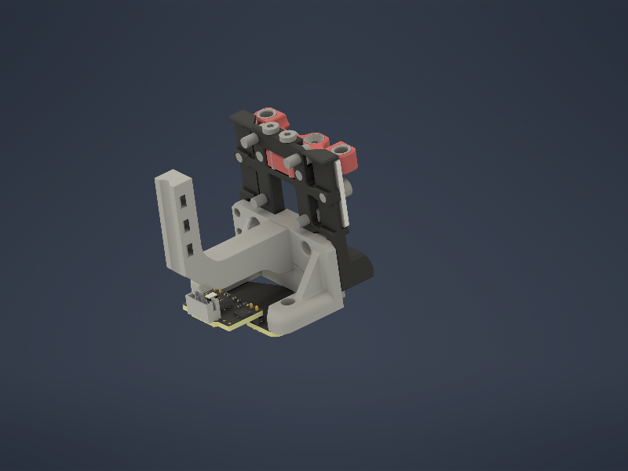

# Cartographer mount for Fysetc CNC SC Shuttle

Made this for Carto V3, testet with V4, should fit Beacon to.

 

Left and right heatset should be set up from carto side, middle one from shuttle side. Build-in support, no slicer support needed!

## BOM

- M3 Heatset inserts

## License

This work is licensed under a
[Creative Commons Attribution-NonCommercial-ShareAlike 4.0 International License][cc-by-nc-sa].

[![CC BY-NC-SA 4.0][cc-by-nc-sa-image]][cc-by-nc-sa]

[cc-by-nc-sa]: http://creativecommons.org/licenses/by-nc-sa/4.0/
[cc-by-nc-sa-image]: https://licensebuttons.net/l/by-nc-sa/4.0/88x31.png
[cc-by-nc-sa-shield]: https://img.shields.io/badge/License-CC%20BY--NC--SA%204.0-lightgrey.svg

### License clarification regarding non-commercial use:
The non-commercial aspect of this license is for cases where A4T is the product, not the use of A4T to create products. 
I.e. If you wish to sell A4T as a product, you would need to seek a commercial license before doing so.  
It is NOT intended to prevent the use of A4T in a printer that you use to provide commercial services. If you want to run A4T as a toolhead for your print farm printers, go right ahead.
