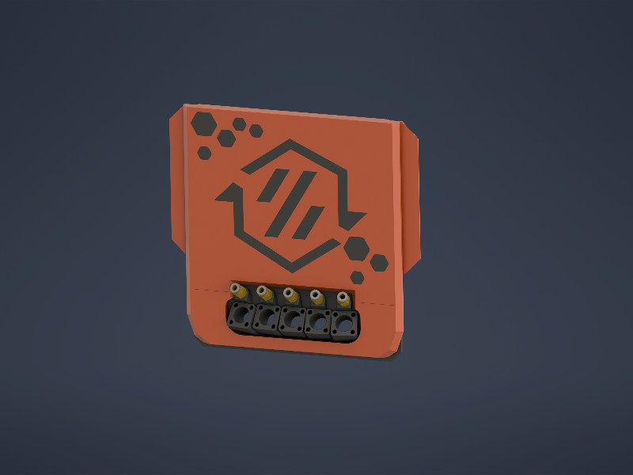
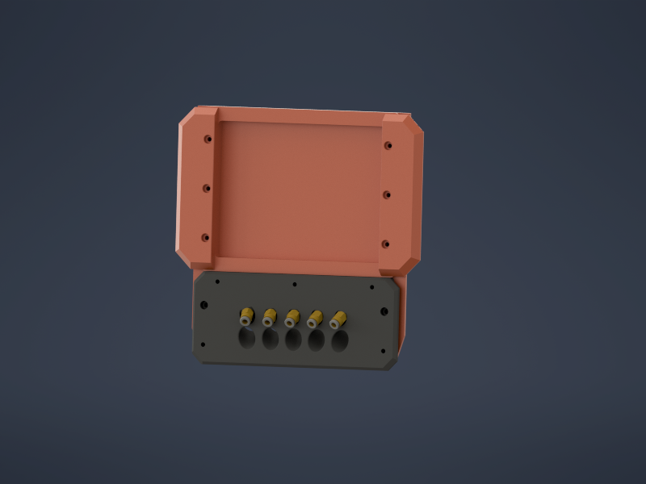

# Umbilical plate with CNLinko and PTFE fitting

Modded these so I can simply remove a toolhead without demounting anything in the back.

For now only as 5 tool variant. 
ATTENTION: The size and the angle of pushfitting prevent this plate to be mounted directly on back extrusion and the backpanel needs another cutout!!!

## BOM

- [CNLinko LP12](https://www.amazon.de/CNLINKO-Rundsteckverbinder-Schnellverschluss-PBT-Geh%C3%A4usestecker-Aviation-Anschluss/dp/B0B2WNRFNN/ref=sr_1_8?__mk_de_DE=%C3%85M%C3%85%C5%BD%C3%95%C3%91&crid=31HCKLI9A3GR1&dib=eyJ2IjoiMSJ9.L5odXJTfpoxo8YV6OnT2q_5GSgZ4KzDZOg1ENMHM5JwE4XixEWpwENqaPSie2-wyaA5wpXWtffSR_hRYZIBBGTI8wDV4xJWWlDDJUiQ13DnhLkQUPkxdZKtnC3E9pcWPqX3PzeCa5KEJhKAv3qHnArC6N7me4QfnSef2qeY_AMVN-j3_3VjM6j1iFVwD4of7s6KCjhvcFn91280NY9s7L1T2Val_TBuXedSlNoLCL8TMVkiRduKI9nkdFzZ9MC6gVtNHbWP36yhV_WWft2eN6v5STPg3mfIZEApL_GGE694.4kCCjL3u9mqjAxWkamm0gUuveR1rReOmQXNcXMH_93k&dib_tag=se&keywords=CNLinko%2BLP-12&qid=1776535240&sprefix=cnlinko%2Blp-1%2Caps%2C143&sr=8-8&th=1)
- [PTFE Pushfitting](https://www.amazon.de/dp/B0DQ7QP5RN?ref=ppx_yo2ov_dt_b_fed_asin_title&th=1)

Thanks to [N3MI-DG](https://github.com/DraftShift/CableManagement/tree/main/UserMods/N3MI-DG/Umbilical_plates_V2)

## License

This work is licensed under a
[Creative Commons Attribution-NonCommercial-ShareAlike 4.0 International License][cc-by-nc-sa].

[![CC BY-NC-SA 4.0][cc-by-nc-sa-image]][cc-by-nc-sa]

[cc-by-nc-sa]: http://creativecommons.org/licenses/by-nc-sa/4.0/
[cc-by-nc-sa-image]: https://licensebuttons.net/l/by-nc-sa/4.0/88x31.png
[cc-by-nc-sa-shield]: https://img.shields.io/badge/License-CC%20BY--NC--SA%204.0-lightgrey.svg

### License clarification regarding non-commercial use:
The non-commercial aspect of this license is for cases where A4T is the product, not the use of A4T to create products. 
I.e. If you wish to sell A4T as a product, you would need to seek a commercial license before doing so.  
It is NOT intended to prevent the use of A4T in a printer that you use to provide commercial services. If you want to run A4T as a toolhead for your print farm printers, go right ahead.

