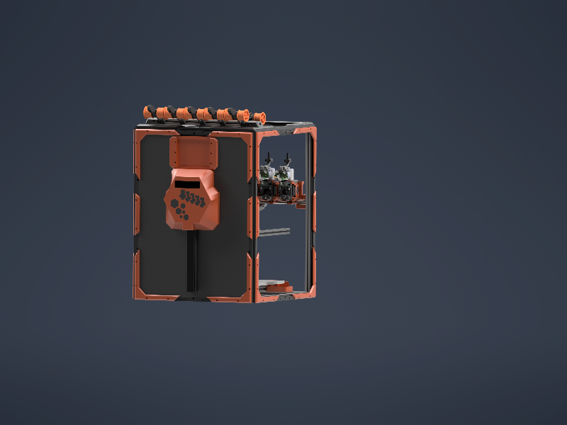

# Hexa Distro Fusion Backpack

Slightly modded version of [Drakarahs backback](https://www.printables.com/model/1366367-fysetc-hexa-distro-fusion-backpack) and you can choose between PUG and cable duct.

 

Fits with [N3MI-DG Umbilical plates](https://github.com/DraftShift/CableManagement/tree/main/UserMods/N3MI-DG/Umbilical_plates_V2) or my [CNlinko umbilical plate](https://github.com/ChrisFo8390/StealthChanger-Mods/tree/main/CableManagement)

## BOM

- M3 Heatset inserts
- Fysetc Hexa Distro Fusion Board

## License

This work is licensed under a
[Creative Commons Attribution 4.0 International License][cc-by].

[![CC BY-NC-SA 4.0][cc-by-image]][cc-by]

[cc-by]: http://creativecommons.org/licenses/by/4.0/
[cc-by-image]: https://licensebuttons.net/l/by/4.0/88x31.png
[cc-by-shield]: https://img.shields.io/badge/License-CC%20BY%204.0-lightgrey.svg
